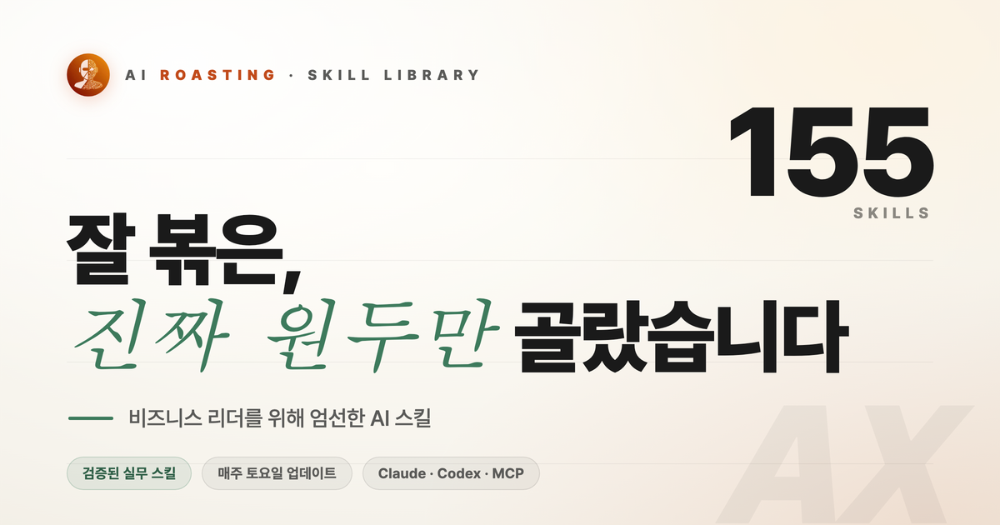

# Skill Library

<a href="https://airoasting.github.io/skill_library/"></a>

비개발자 비즈니스 리더를 위해 큐레이션한 Claude 스킬·플러그인·MCP 카탈로그입니다. 현재 **155개 카드 · 13개 카테고리 · 30개 에디터픽**이 등록되어 있고, 모든 데이터는 단일 파일 `skills.json`에서 관리합니다.

🌐 라이브 사이트: <https://airoasting.github.io/skill_library/>

## 무엇이 들어 있나

- **3개 메타 카테고리**로 묶인 13개 세부 카테고리
  - 🏗 **AI 에이전트팀 구축** — 하네스/에이전트 설계, AI와 일 잘하는 법, 토큰 절약, 외부 연동·MCP, 한국 특화
  - 📈 **비즈니스 성장** — 그로스·마케팅, 투자·금융, GEO·AEO
  - 🎯 **실행력 제고** — 리서치·인사이트, 디자인, 글쓰기, 법무·컴플라이언스, 커리어·이직
- 카드별 정보: `repo`, `author`, `stars`, `desc`(한국어 2문장), `tags`, `lang`, `added_at`, `editors_pick`
- `meta_categories[]`·`categories[]` 정의에는 "이 카테고리는 어떤 일을 위한 것인가"가 한 줄로 들어 있어, 자연어로 골라 쓰기 좋습니다.

## 카드 둘러보기

가장 빠른 방법은 라이브 사이트입니다. 카테고리 칩 → 카드 → 원 저장소로 바로 이동할 수 있어요.

🌐 <https://airoasting.github.io/skill_library/>

URL 파라미터로 바로 들어갈 수도 있습니다.

| URL | 결과 |
|---|---|
| `?cat=workflow` | "AI와 일 잘하는 법" 카테고리만 |
| `?cat=korea` | "한국 특화 스킬·MCP"만 |
| `?cat=pick` | 에디터픽 30개만 |
| `?cat=lab` | AI Roasting Lab 실험 카드만 |

## `/find-skill` — 자연어로 스킬 찾기

라이브러리를 Claude Code에서 클론해 열면 자동으로 잡히는 슬래시 커맨드입니다. 카테고리를 일일이 훑지 않아도, 지금 하고 싶은 일을 한 줄로 던지면 카탈로그 안에서 가장 잘 맞는 카드 N개를 골라줍니다.

```
/find-skill 한국어로 쓴 보고서 초안에서 AI 티 좀 빼고 싶어
/find-skill 이번 분기 실적 발표 자료 만드는 데 도움 받을 도구
/find-skill --cat finance 종목 리서치 자동화
/find-skill --pick 처음 깔면 가장 임팩트 큰 스킬 3개
```

**옵션**

| 옵션 | 설명 |
|---|---|
| `--n <int>` | 추천 개수 (기본 3, 최대 8) |
| `--cat <category-id>` | 특정 카테고리로 한정 |
| `--meta build\|growth\|execution` | 메타 카테고리로 한정 |
| `--pick` | `editors_pick: true`인 카드만 |

**무엇을 보고 고르나.** 자연어 질의에서 작업 의도와 제약(한국어, 비개발자, 도메인 등)을 분리한 뒤, 각 카드의 의도 적합도·카테고리 정의·제약 충족·신뢰 보정을 합산해 상위 N개를 뽑습니다. 결과가 한 카테고리에 몰리면 같은 카테고리 최대 2개로 제한해 다양성을 확보합니다.

**무엇을 안 하나.** 이 커맨드는 **라이브러리 안의 카드만** 봅니다. 외부 도구나 신규 후보를 절대 추천하지 않아요. 라이브러리에 없는 분야면 "여긴 없어요"라고 솔직히 답합니다. 점수·내부 룰은 출력에 노출하지 않고 결과만 한국어 카드 형식으로 보여줍니다.

자세한 동작 규칙: [.claude/commands/find-skill.md](.claude/commands/find-skill.md)

## `/discovery-skill` — 라이브러리에 없는 스킬 찾기

`/find-skill`이 "여긴 없네요"라고 답했거나 처음부터 라이브러리 밖까지 보고 싶을 때 쓰는 커맨드입니다. GitHub에서 후보를 찾아 **에디터픽 평가 기준 그대로** 점수를 매겨주기 때문에, 점수와 근거를 보고 도입 여부를 직접 판단할 수 있어요.

```
/discovery-skill 영업 이메일 자동 분류·답변 초안
/discovery-skill --cat legal 한국 NDA 자동 검토
/discovery-skill --min 4.0 메일 마감 추적 도구 강력 추천만 보여줘
```

**옵션**

| 옵션 | 설명 |
|---|---|
| `--n <int>` | 추천 개수 (기본 3, 최대 6) |
| `--cat <category-id>` | 라이브러리 카테고리로 한정 |
| `--min <float>` | 평균 점수 컷오프 (기본 3.5) |

**평가 방식.** 모든 후보는 라이브러리 큐레이션이 사용하는 동일한 3축 5점 척도로 채점됩니다.

| 축 | 묻는 질문 |
|---|---|
| **효용성** | 비즈니스 리더가 얼마나 빨리·얼마나 큰 효용을 뽑는가 |
| **대표성** | 그 카테고리에서 라이브러리 기존 카드 대비 어떤 위상인가 |
| **신뢰성** | ★수, 저자 검증, 유지보수 활성도 |

평균 4.5+면 ✦✦✦ 강력 추천, 4.0~4.4 ✦✦ 추천, 3.5~3.9 ✦ 검토. 점수와 근거가 같이 출력되니 큐레이터의 판단을 신뢰하지 않아도 직접 검증 가능합니다.

**무엇을 안 하나.** 라이브러리에 **이미 있는 카드는 절대 다시 추천하지 않습니다** (그건 `/find-skill`). 라이브러리에 카드를 직접 추가하지도 않습니다 — 좋은 후보를 찾으면 [Issue](https://github.com/airoasting/skill_library/issues/new)로 알려주시면 큐레이터가 직접 검토 후 라이브러리에 반영합니다.

자세한 동작 규칙: [.claude/commands/discovery-skill.md](.claude/commands/discovery-skill.md)

## 데이터 구조

```jsonc
{
  "authors": {
    "<owner>": { "facebook": "...", "linkedin": "...", "x": "..." }
  },
  "meta_categories": [
    { "id": "build", "name": "AI 에이전트팀 구축", "emoji": "🏗", "desc": "..." }
  ],
  "categories": [
    { "id": "workflow", "meta": "build", "name": "AI와 일 잘하는 법",
      "emoji": "🚀", "desc": "..." }
  ],
  "skills": [
    {
      "category": "workflow",
      "name": "Superpowers",
      "repo": "obra/superpowers",
      "author": "Jesse Vincent",
      "stars": 184535,
      "forks": 16395,
      "desc": "이 스킬은 ... 입니다. ... 때문에 ...에 적합합니다.",
      "tags": ["#workflow-engine", "#tdd", "#brainstorming"],
      "lang": "Shell",
      "added_at": "2025-10-09",
      "editors_pick": true
    }
  ]
}
```

`skills.json`이 단일 진실 공급원이지만, 정적 호스팅(`file://` 직접 열기) 환경을 위해 `index.html` 안에 동일 JSON이 인라인으로 박혀 있습니다. 두 곳을 같이 갱신해야 합니다 ([app.js:50](app.js:50) 폴백 로직 참고).

## 프로젝트 레이아웃

```
.
├── index.html          # 카탈로그 페이지 (인라인 skills-data 포함)
├── app.js              # 검색·필터·URL 라우팅
├── skills.json         # 데이터 단일 소스
├── asset/              # OG 이미지·아이콘
├── scripts/
│   ├── sync-stars.py   # GitHub 별·포크 수 동기화
│   └── sync-inline.py  # skills.json → index.html 인라인 블록
└── .claude/commands/
    ├── find-skill.md      # 라이브러리 안에서 카드 추천
    └── discovery-skill.md # 라이브러리 밖에서 후보 발굴 + 점수 평가
```

## 로컬에서 보기

별도 빌드 단계가 없습니다.

```bash
# 가장 간단: file://로 직접 열기 (인라인 폴백 사용)
open index.html

# 또는 정적 서버
python3 -m http.server 8000
# → http://localhost:8000
```

## 카드를 제안하고 싶다면

추천 후보가 있으면 [Issue](https://github.com/airoasting/skill_library/issues/new)를 열어 GitHub 주소·카테고리 후보·한 줄 추천 사유를 남겨주세요. 큐레이터가 직접 검토 후 라이브러리에 반영합니다.

`/discovery-skill`로 외부에서 점수와 함께 평가받아 본 후보면 더 좋습니다.

## 라이선스

스킬 카드의 메타데이터는 라이브러리 운영을 위한 큐레이션입니다. 각 스킬의 코드와 라이선스는 원 저장소를 따릅니다.
